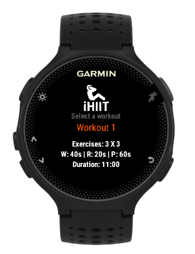
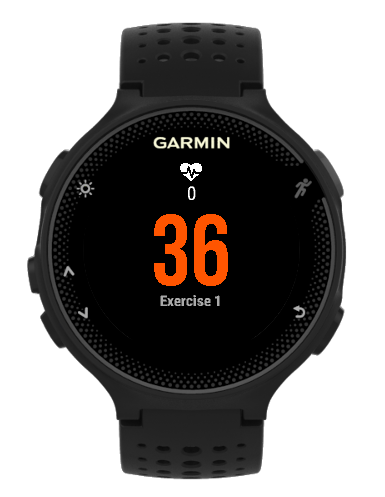
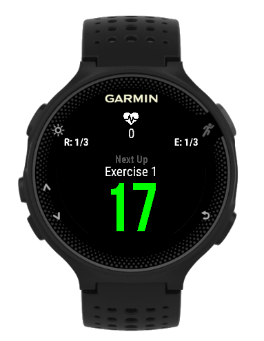
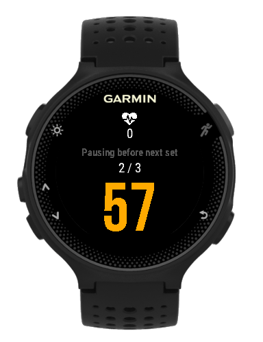
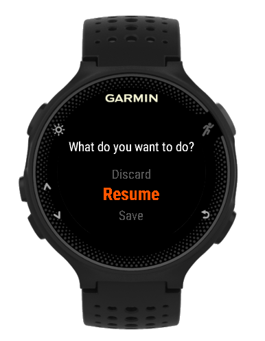
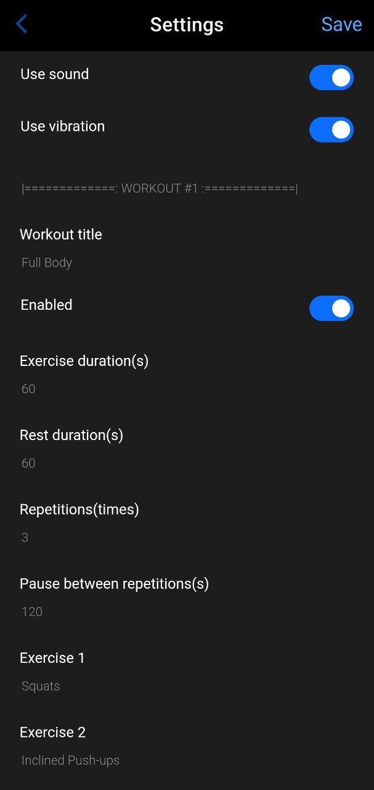

# iHIIT

High Intensity Interval Training (HIIT or any other repetition based) App for your Garmin device. This app was written originally for my Forerunner 235 and it is intented to maintain compatibility with all those older devices which do not have the HIIT activity type and therefore can not be syncronized with Garmin's built-in HIIT workouts. This app is and will always remain free.

## How to obtain it?

You can install the app on your device through the Connect IQ app. Just search for "iHIIT" and look for the below icon. This is a [direct link](https://apps.garmin.com/en-US/apps/bc02f0f2-9d7d-4476-8aaf-ef99f2e78c33) to the app page.

## What devices are compatible?

Please use the [Compatible Devices](https://apps.garmin.com/apps/bc02f0f2-9d7d-4476-8aaf-ef99f2e78c33?tid=1) page and check if your device is listed there. You can also take a look at this [device list](./docs/devices.md) which is used as a checklist to add new devices to the application.

## How does it work?

You can configure up to 5 workouts. Each workout can contain up to 20 exercises with a set exercise duration and a rest duration. Additionally, you can configure how many times the workout will repeat the set of exercises (repetitions) and the time to pause between repetitions.

When you start the app on your watch it will propose you the configured workouts. You can scroll through the exercises with the up/down buttons and select one with the activity button.

The exercise select screen, as shown on the screenshot above, shows you the name of the workout together with the details of that workout configured by you:

- `Exercises: [# of Repetitions] X [# of Exercises]` - Shows how many exercises you will be doing through how many repetitions.
- `W: [Exercise duration] | [Rest duration] | [Pause duration]` - The duration in seconds of each exercise, the rest between them and the length of the pause between two consecutive repetitions.
- `Duration: [Workout duration]` - Displays the overall duration of the workout.

Once the workout is selected, iHIIT will lead you through your configured exercises alternating between exercise and rest periods. The app uses the KISS (Keep It Simple, Stupid!) principle for the interface purposefully. When you are doing high intensity workout you do not have the time to look at your watch. So do not expect fancy graphs showing HR histograms. You will encounter 3 screens: Work, rest, and pause.

The `Work` screen displays only the name of the exercise you are doing and a big countdown number in the center showing how many seconds you have remaning.

The `Rest` screen displays:

- `Next Up` - the name of the next exercise that is coming up
- the countdown showing how many seconds remain to rest
- `R: [Current repetition] / [Total number of repetitions]`
- `E: [Current exercise] / [Total number of exercises]`

The `Pause` screen shown between consecutive repetitions displays the number of repetitions completed out of the total number of repetitions as well as the countdown of the time remaining until the start of the next repetition.

Additionally, all of the above screens will display the current heart rate below the heart icon on the top of the screen.

A beep and a vibration will let you know when you are changing from work to rest and vice versa. This can now be configured to be swithed on/off in the application settings.

At any moment during a running workout you can press the `activity` or the `back` button to bring up the options menu that will allow you to `Save`, `Discard` or `Resume` the workout. Whilst the menu is shown your workout will remain paused.

## How to configure iHIIT?

The easiest way to configure iHIIT is through the use the Garmin ConnctIQ application installed on your mobile phone. Alternatively, you can use the GarminExpress application installed on your PC.

**On Garmin ConnctIQ:**
Open "My Device Apps" and Select the `iHIIT` application from the list of apps installed on your device. Hit the `Settings` button to open the configuration window. Enter/change your configuration and click `Save`. Your configuration will be immediately transferred to your device.

**On GarminExpress:**
Select the `iHIIT` application from the list of IQ Apps installed on your device. Hit the `...` button next to the name of of the application to open the configuration window. Enter/change your configuration and click `Save`. Your configuration will be immediately transferred to your device.

Independently from how you are configuring the application you will be able to set the following options:

### Application configuration options

- Use sound: When enabled the app will use sound to warn you 3 seconds before time is up (both in `Work` and in `Rest` phase).
- Use vibration: When enabled the app will use vibration to warn you 3 seconds before time is up (both in `Work` and in `Rest` phase).

### Workout configuration options

For each workout you can configure the following options:

- `Title` - The title of the workout that will show up on the workout selection screen.
- `Enabled` - Only enabled workouts will be shown on the workout selection screen.
- `Exercise duration(s)` - The duration in seconds of each exercise.
- `Rest duration(s)` - the duration in seconds of the rest period between exercises.
- `Repetitions(s)` - The number of times the set of exercises will be repeated during the workout.
- `Pause between repetitions(s)` - The pause in seconds you will have between the end of one and the beginning of another repetition.
- `Exercise 1 - 20` - The names of the exercises configured for this workout. Please note that the naming of the exercises must be consecutive. The first blank exercise title will indicate the end of the workout.

## Bugs? Enhancements? Contributions

Please use github for [Issues & enhancement requests](https://github.com/adamjakab/iHIIT/issues).

Contributions are always welcome!
